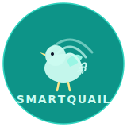

# SmartQuail — Landing Page

<div align="center">
  

  **Landing page showcase untuk SmartQuail — Sistem Monitoring & Kontrol Kandang Burung Puyuh Berbasis IoT**

  [](https://developer.mozilla.org/en-US/docs/Web/HTML)
  [](https://tailwindcss.com)
  [](https://developer.mozilla.org/en-US/docs/Web/JavaScript)
  [](#)
  [](LICENSE)
</div>

---

## Tentang

Landing page ini adalah halaman *showcase* untuk proyek **SmartQuail** — sistem IoT monitoring kandang puyuh yang dikembangkan sebagai proyek riset di **BINUS University, Jakarta (2026)**. Dibangun untuk keperluan:

- **Brand awareness** — menampilkan SmartQuail sebagai solusi credible
- **Portofolio riset** — dokumentasi profesional jangka panjang
- **Multi-audience** — akademisi, industri, peternak, mahasiswa

## Preview

| Light Mode | Dark Mode |
|---|---|
| *(Lihat langsung di browser)* | *(Klik toggle matahari/bulan)* |

## Tech Stack

| Layer | Teknologi | Keterangan |
|---|---|---|
| Markup | HTML5 | Semantic, accessible |
| Styling | Tailwind CSS v3 | Via CDN, zero build step |
| Script | Vanilla JavaScript ES6+ | Dark mode, scroll reveal, mobile nav |
| Font | Inter | Google Fonts CDN |
| Ikon | SVG Inline | No external icon library |
| Hosting | Static | Bisa langsung buka file / deploy Vercel / Netlify |

**Nihil dependency. Nihil build step.** Cukup double-click `index.html`.

## Struktur File

```
Landing_Page/
├── index.html                  # Single-page, 10 section
├── PRD.md                      # Product Requirement Document
├── README.md                   # File ini
└── assets/
    ├── css/
    │   └── style.css           # Custom CSS: animasi, glassmorphism, dark mode
    ├── js/
    │   └── main.js             # Dark mode toggle, scroll reveal, counter, mobile nav
    └── img/
        ├── logo.svg            # Logo SmartQuail (quail silhouette + IoT)
        ├── system-diagram.svg  # Diagram arsitektur: ESP32 → Firebase → Flutter
        └── dashboard-mock.svg  # Mockup dashboard aplikasi Flutter
```

## Section Halaman

| # | Section | Deskripsi |
|---|---|---|
| 1 | Navbar | Fixed, glassmorphism blur, dark mode toggle, mobile hamburger |
| 2 | Hero | Tagline, subtitle, 2 CTA, system diagram visual |
| 3 | Problem Statement | 3 pain point cards (Heat Stress, Monitoring Manual, Respon Lambat) |
| 4 | Fitur Unggulan | 6 feature cards grid (Real-time Monitor, Kontrol, Riwayat, Alert, Auto PWM, Multi-platform) |
| 5 | Cara Kerja | 4 step cards + system architecture diagram |
| 6 | Demo / Preview | Dashboard mockup + highlight fitur checklist |
| 7 | Dampak & Data | 4 stat cards dengan counter animation |
| 8 | Tim | Ricky Rudiansyah & Marcellino Asanuddin profile cards + supervisor |
| 9 | CTA Final | WhatsApp + Email buttons dengan background gradient teal |
| 10 | Footer | Logo, links, copyright BINUS University 2026 |

## Cara Menjalankan

### Tanpa server (rekomendasi untuk testing cepat)

```
double-click index.html
```

### Dengan live server (opsional)

```bash
npx serve .
# atau
python -m http.server 8080
```

Buka `http://localhost:8080` di browser.

## Fitur

### Dark Mode
- **Auto-detect** preferensi sistem (`prefers-color-scheme`)
- **Manual toggle** via tombol matahari/bulan di navbar
- **Persist** ke `localStorage` — preferensi diingat antar sesi
- **Transisi halus** pada background, teks, dan border

### Animasi
- **Scroll reveal** — fade-in + translateY via `IntersectionObserver`
- **Stagger children** — card grid muncul bertahap
- **Counter animation** — angka di section dampak beranimasi saat masuk viewport
- **Hover card** — scale + shadow elevation
- **Pill badge pulse** — dot indikator berkedip

### Responsif
- **Mobile-first** — single column, hamburger menu, tap-friendly spacing
- **Tablet (768px)** — 2 column grids
- **Desktop (1024px+)** — 3 column grids, hero split layout

### Glassmorphism Navbar
- `backdrop-filter: blur(12px)` dengan background semi-transparan
- Border subtle — berubah responsif terhadap scroll dan dark mode

## Hal yang Perlu Di-update

Berikut adalah placeholder yang perlu diisi dengan data asli:

| Lokasi | Item | Status |
|---|---|---|
| `index.html` line ~380 | Nomor WhatsApp (`6280000000000`) | Placeholder |
| `index.html` line ~385 | Alamat email (`smartquail@email.com`) | Placeholder |
| `index.html` Team section | Foto asli Ricky & Marcell (ganti inisial `RR`/`MA`) | Placeholder |
| `index.html` Team section | Link GitHub & LinkedIn Ricky + Marcell | Placeholder |
| `assets/img/dashboard-mock.svg` | Screenshot dashboard Flutter asli | Placeholder |
| `index.html` Impact section | Data konkret (akurasi sensor, penurunan THI, dll) | Placeholder |

Cara update: buka `index.html`, cari komentar `<!-- ==================== TEAM ==================== -->`, ganti section terkait.

## Warna & Design System

| Nama | Hex | Tailwind | Kegunaan |
|---|---|---|---|
| Primary | `#0D9488` | `primary-600` | Teal — button, link, heading accent |
| Primary Light | `#14B8A6` | `primary-500` | Hover state, badge |
| Surface (light) | `#FFFFFF` | `white` | Card, section background |
| Surface (dark) | `#0F172A` | `gray-900` | Card, section background |
| Text (light) | `#0F172A` | `gray-900` | Heading, body text |
| Text (dark) | `#F1F5F9` | `gray-100` | Heading, body text |
| Subtext | `#64748B` | `gray-500` | Deskripsi, label |
| Font | Inter | — | 400, 500, 600, 700, 800, 900 |

## Tim Pengembang

| Nama | Role |
|---|---|
| **Ricky Rudiansyah** | Mobile Developer (Flutter) |
| **Marcellino Asanuddin** | IoT & Hardware Engineer |
| **Prof. Dr. Ir. Widodo Budiharto** | Supervisor — BINUS University |

## Lisensi

Proyek ini menggunakan lisensi [MIT](LICENSE).

---

<div align="center">
  <sub>Dibangun dengan kode bersih — siap di-share & di-deploy kapan saja.</sub>
</div>
