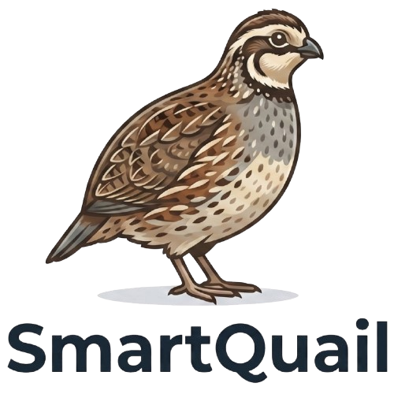

# SmartQuail — Landing Page

<div align="center">
  

  **Landing page showcase untuk SmartQuail — Sistem Monitoring & Kontrol Kandang Burung Puyuh Berbasis IoT**

  [](https://developer.mozilla.org/en-US/docs/Web/HTML)
  [](https://tailwindcss.com)
  [](https://developer.mozilla.org/en-US/docs/Web/JavaScript)
  [](LICENSE)

  **Live:** [rickyrudiansyah.github.io/SmartQuailCom](https://rickyrudiansyah.github.io/SmartQuailCom)
</div>

---

## Tentang

Landing page ini adalah halaman *showcase* untuk proyek **SmartQuail** — sistem IoT monitoring kandang puyuh yang dikembangkan sebagai proyek riset di **BINUS University, Jakarta (2026)**. Dibangun untuk:

- **Brand awareness** — menampilkan SmartQuail sebagai solusi credible
- **Portofolio riset** — dokumentasi profesional jangka panjang
- **Multi-audience** — akademisi, industri, peternak, mahasiswa

## Demo Video

<div align="center">
  <a href="https://youtu.be/FjUddvyp5Rs" target="_blank">
    
  </a>
  <p><a href="https://youtu.be/FjUddvyp5Rs">Tonton di YouTube</a></p>
</div>

## Tech Stack

| Layer | Teknologi | Keterangan |
|---|---|---|
| Markup | HTML5 | Semantic, accessible |
| Styling | Tailwind CSS v3 | Production build via npm (~30KB CSS) |
| Script | Vanilla JavaScript ES6+ | Dark mode, scroll reveal, mobile nav |
| Font | Inter | Google Fonts CDN |
| Ikon | SVG Inline | No external icon library |
| Hosting | Static | GitHub Pages / Vercel / Netlify |

**Nihil dependency runtime. Build step:** `npm install && npm run build`. **Dev server:** `npm run dev` (YouTube embed perlu local server — tidak bisa via `file://`).

## Struktur File

```
Landing_Page/
├── index.html                     # Single-page, 10 section
├── package.json                   # Tailwind CSS build + dev server
├── tailwind.config.js             # Tailwind config (teal palette)
├── PRD.md                         # Product Requirement Document
├── README.md                      # File ini
├── .gitignore
├── src/
│   └── input.css                  # Tailwind directives source
└── assets/
    ├── css/
    │   ├── tailwind.min.css       # Production build output (~30KB)
    │   └── style.css              # Custom CSS: animasi, glassmorphism, dark mode
    ├── js/
    │   └── main.js                # 6 modules: dark mode, YouTube, mobile nav, scroll reveal, counter, active nav
    └── img/
        ├── smartquail.png         # Logo SmartQuail
        ├── logo.svg               # Logo SVG
        └── team/
            ├── ricky.jpeg         # Foto Ricky Rudiansyah
            └── marcell.jpg        # Foto Marcellino Asanuddin
```

## Section Halaman

| # | Section | Deskripsi |
|---|---|---|
| 1 | **Navbar** | Fixed, glassmorphism blur, dark mode toggle, mobile hamburger |
| 2 | **Hero** | Tagline gradient, interactive architecture stack, 2 CTA, scroll indicator |
| 3 | **Problem Statement** | 3 pain point cards (Heat Stress, Monitoring Manual, Respon Lambat) |
| 4 | **Fitur Unggulan** | 6 feature cards grid (Real-time Monitor, Kontrol, Riwayat, Alert, Auto PWM, Multi-platform) |
| 5 | **Cara Kerja** | 4 step cards + 3-column interactive architecture block + data flow indicator |
| 6 | **Demo** | **YouTube embed** `FjUddvyp5Rs` + 4 feature highlight checklist |
| 7 | **Dampak & Data** | 4 stat cards dengan counter animation |
| 8 | **Tim** | Ricky Rudiansyah & Marcellino Asanuddin — foto asli + verified badge + live GitHub & LinkedIn |
| 9 | **CTA Final** | WhatsApp +62818860008 & Email marcellinoasanuddin@gmail.com |
| 10 | **Footer** | Logo, links, copyright BINUS University 2026 |

## Cara Menjalankan

### Production build

```bash
npm install
npm run build        # generate assets/css/tailwind.min.css (~30KB)
```

Lalu buka `index.html` lewat local server (YouTube embed tidak bisa via `file://`):

```bash
npm run dev          # serve via http://localhost:3000
```

Atau deploy langsung ke GitHub Pages / Vercel / Netlify.

### Development (watch mode)

```bash
npm run watch        # auto-rebuild CSS setiap ada perubahan
```

## Fitur

### Dark Mode
- **Auto-detect** preferensi sistem (`prefers-color-scheme`)
- **Manual toggle** via tombol matahari/bulan di navbar + mobile menu
- **Persist** ke `localStorage` — preferensi diingat antar sesi
- **Transisi halus** pada background, teks, border, dan shadow

### Animasi
- **Scroll reveal** — fade-in + translateY via `IntersectionObserver`
- **Stagger children** — card grid muncul bertahap (delay 100ms)
- **Counter animation** — angka di section dampak beranimasi saat masuk viewport
- **Hover card** — scale + shadow elevation + teal border glow
- **Hover avatar** — scale 1.05 pada foto tim
- **Pill badge pulse** — dot indikator berkedip
- **Scroll indicator** — animasi bounce di bottom hero
- **CTA border glow** — animasi pulse pada outline button contact

### UI/UX Polish
- **Section accent** — gradient underline teal di setiap section header
- **Architecture blocks** — 3 card interaktif dengan hover lift + shadow + tag label
- **Animated data flow** — bouncing dots di connection arrows (WiFi, HTTPS)
- **Button hover states** — GitHub → hitam, LinkedIn → biru (#0A66C2)
- **Verified badge** — centang hijau di foto tim

### Responsif
- **Mobile-first** — single column, hamburger menu, tap-friendly spacing
- **Tablet (768px)** — 2 column grids
- **Desktop (1024px+)** — 3 column grids, hero split layout, horizontal architecture

### Glassmorphism Navbar
- `backdrop-filter: blur(12px)` dengan background semi-transparan
- Border subtle — berubah responsif terhadap scroll dan dark mode

## Kontak

| Channel | Detail |
|---|---|
| **WhatsApp** | [+62 818-8600-008](https://wa.me/62818860008) |
| **Email** | [marcellinoasanuddin@gmail.com](mailto:marcellinoasanuddin@gmail.com) |

## Tim Pengembang

| Nama | Role | GitHub | LinkedIn |
|---|---|---|---|
| **Ricky Rudiansyah** | Mobile Developer (Flutter) | [@RickyRudiansyah](https://github.com/RickyRudiansyah) | [ricky-rudiansyah-933344351](https://www.linkedin.com/in/ricky-rudiansyah-933344351) |
| **Marcellino Asanuddin** | IoT & Hardware Engineer | [@masanuddin](https://github.com/masanuddin) | [marcellino-asanuddin](https://www.linkedin.com/in/marcellino-asanuddin) |
| **Prof. Dr. Ir. Widodo Budiharto** | Supervisor — BINUS University | — | — |

## Hal yang Masih Placeholder

| Lokasi | Item |
|---|---|
| `index.html` Impact section | Data konkret dampak (akurasi sensor, penurunan THI, dll) — saat ini data ilustratif |

## Warna & Design System

| Nama | Hex | Tailwind | Kegunaan |
|---|---|---|---|
| Primary | `#0D9488` | `primary-600` | Teal — button, link, heading accent |
| Primary Light | `#14B8A6` | `primary-500` | Hover state, badge |
| Surface (light) | `#FFFFFF` | `white` | Card, section background |
| Surface (dark) | `#0F172A` | `gray-900` | Card, section background |
| Text (light) | `#0F172A` | `gray-900` | Heading, body text |
| Text (dark) | `#F1F5F9` | `gray-100` | Heading, body text |
| Subtext | `#64748B` | `gray-500` | Deskripsi, label |
| Font | Inter | — | 400, 500, 600, 700, 800, 900 |

## Changelog

### v1.3.0 (30 Jun 2026) — Production Build & Polish

| Komponen | Perubahan |
|---|---|
| **Tailwind** | CDN (3MB+) → production build via npm (~30KB CSS) |
| **YouTube** | Thumbnail click-to-play pattern, fix Error 153, fallback link |
| **Counter** | Fix bug `parseInt` pada desimal (0.3°C sekarang beranimasi) |
| **CSS** | Hapus transisi universal `html *` (jank fix), deduplicate `.card-hover` |
| **Aksesibilitas** | Skip-to-content link, `:focus-visible` styles, mobile menu class-based scroll lock |
| **SEO** | Favicon, Open Graph + Twitter Card meta tags |
| **Performa** | Image `width`/`height` atribut (CLS fix), hapus 3 aset tak terpakai |
| **Navigasi** | Link "Masalah" & "Dampak" ke navbar |
| **DevOps** | `npm run dev` local server, `tailwind.config.js`, updated PRD & README |

### v1.2.0 (30 Jun 2026) — Demo + UI Polish

| Komponen | Perubahan |
|---|---|
| **Demo section** | YouTube embed `FjUddvyp5Rs` ganti mockup SVG + fallback link |
| **Team section** | Foto asli Ricky & Marcell + verified badge |
| **Tim links** | GitHub & LinkedIn live (RickyRudiansyah, masanuddin) |
| **Kontak** | WA +62818860008, email marcellinoasanuddin@gmail.com |
| **Arsitektur** | Dari SVG statis → HTML/CSS interaktif dengan hover + animated data flow |
| **UI** | Section accent underline, scroll indicator, CTA border glow, button hover states |
| **Dark mode** | Mobile toggle sync, improved card shadows, diagram surface fix |

### v1.1.0 (30 Jun 2026) — Initial Release

| Komponen | Perubahan |
|---|---|
| **Semua section** | 10 section landing page complete |
| **Dark mode** | Auto-detect + toggle + localStorage |
| **Animasi** | Scroll reveal, stagger, counter |
| **SVG assets** | Logo, system diagram, dashboard mockup |
| **PRD + README** | Full documentation |

## Lisensi

Proyek ini menggunakan lisensi [MIT](LICENSE).

---

<div align="center">
  <sub>Dibangun dengan kode bersih — siap di-share & di-deploy kapan saja. &copy; 2026 BINUS University</sub>
</div>
